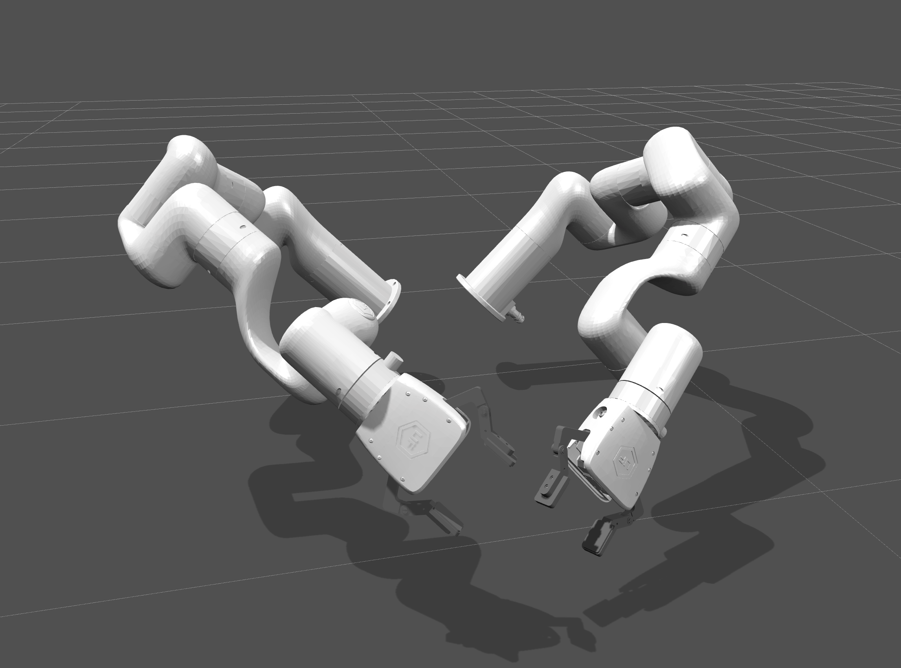
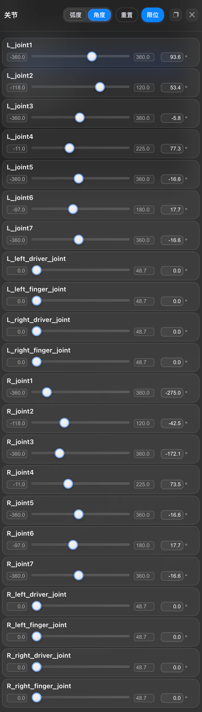

# Bimanual xArm7

## Overview

This package contains a simplified robot description (MJCF) of the [xArm7
arm](https://www.ufactory.cc/product-page/ufactory-xarm-7/) developed by
[UFACTORY](https://www.ufactory.cc/). It is derived from the [publicly available
URDF
description](https://github.com/xArm-Developer/xarm_ros/tree/master/xarm_description/urdf/xarm7), referencing [MuJoCo Menagerie](https://github.com/google-deepmind/mujoco_menagerie).

  
  

